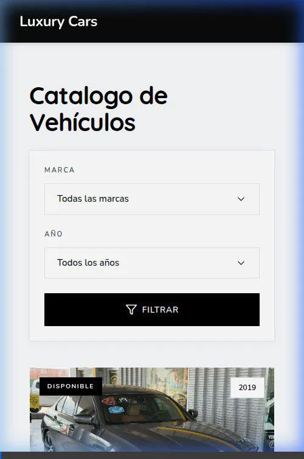
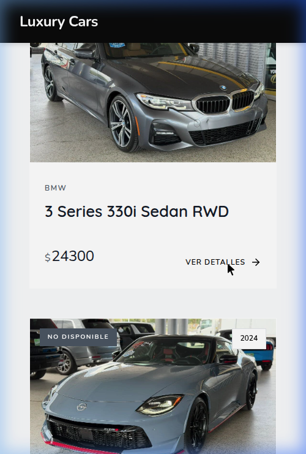
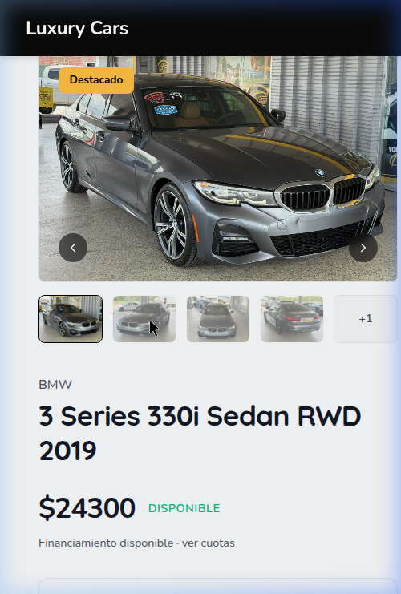

# 🏎️ Luxury Cars - Premium Dealership Platform



**Luxury Cars** es una plataforma digital desarrollada en Django diseñada para concesionarios de vehículos de alta gama. Su objetivo es transformar la experiencia de compra de automóviles en línea, ofreciendo una interfaz editorial, limpia y altamente optimizada para la conversión.

---

## 📊 Caso de Estudio: Elevando la Experiencia de Compra Digital

### El Problema
La mayoría de los concesionarios tradicionales enfrentan un problema crítico en su transición digital: **fricción y pérdida de confianza**. Sus catálogos en línea suelen ser heredados, lentos, difíciles de navegar en dispositivos móviles y carecen de una estética que refleje el valor de los vehículos que venden. Peor aún, los canales de contacto suelen estar ocultos tras formularios largos y tediosos, lo que provoca que los clientes potenciales abandonen el proceso antes de comunicarse con el equipo de ventas.

### La Solución
**Luxury Cars** resuelve este problema al replantear el inventario de vehículos no como una base de datos, sino como una *experiencia de exhibición premium*. 
- **Diseño Editorial y Suave:** Utilizando tipografías amigables y redondeadas (*Quicksand* y *Nunito*), una paleta de colores minimalista y esquinas suaves, generamos una experiencia inmersiva que construye confianza de manera instantánea.
- **Fricción Cero:** Reemplazamos los formularios complejos por un único y vibrante llamado a la acción: **"Contáctanos" vía WhatsApp**. Esto preconfigura un mensaje dinámico con los detalles exactos del vehículo (Marca, Modelo, Año), conectando al cliente con un agente en menos de dos clics y aumentando drásticamente la tasa de conversión a leads (*hot leads*).

---

## ✨ Características Principales

### 1. Catálogo Dinámico e Inteligente
Un inventario visualmente impactante donde cada tarjeta de vehículo respira. Los filtros rápidos por **Marca** y **Año** permiten a los usuarios encontrar su próximo vehículo sin recargar la página innecesariamente.



### 2. Ficha Técnica Inmersiva
El corazón de la conversión. Una vista detallada que presenta una galería de imágenes interactiva (carrusel) combinada con especificaciones técnicas claras y un diseño *Dark Mode* parcial que hace resaltar las fotografías del vehículo por encima de todo.



### 3. Integración Directa con Ventas
El sistema toma los parámetros exactos del modelo y año del vehículo y genera un enlace pre-estructurado para la API de WhatsApp, garantizando que el equipo de ventas siempre sepa exactamente por cuál auto está preguntando el cliente.

---

## 🛠️ Stack Tecnológico

- **Backend:** Python / Django 6.0
- **Base de Datos:** SQLite (Desarrollo) / PostgreSQL (Producción)
- **Frontend:** HTML5, CSS3 (Vanilla), JavaScript (ES6)
- **Diseño UI:** Arquitectura de diseño de componentes personalizados (Tipografía de Google Fonts, iconografía SVG ligera).

---

## 🚀 Instalación y Despliegue Local

Sigue estos pasos para probar el proyecto en tu entorno local:

1. **Clona el repositorio e ingresa al directorio:**
   ```bash
   git clone <tu-repositorio>
   cd landing_concessionaire
   ```

2. **Activa el entorno virtual e instala las dependencias:**
   ```bash
   python -m venv env
   source env/bin/activate  # En Windows usa: env\Scripts\activate
   pip install -r requirements.txt
   ```

3. **Aplica las migraciones de la base de datos:**
   ```bash
   python manage.py makemigrations
   python manage.py migrate
   ```

4. **Inicia el servidor de desarrollo:**
   ```bash
   python manage.py runserver
   ```

5. Visita `http://127.0.0.1:8000` en tu navegador.

---
*Diseñado con pasión para redefinir el estándar en la venta automotriz digital.*
